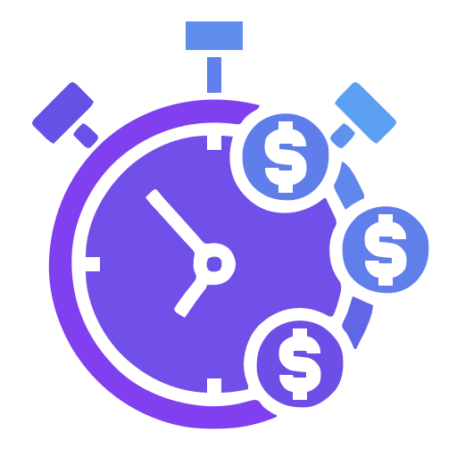

# 🚀 Ishita's CoinWatch — Real-Time Crypto Price Tracker

A cryptocurrency tracking platform built with React and Tailwind CSS, leveraging the CoinGecko API to provide real-time data on prices, market trends, and historical statistics. The platform offers an intuitive interface for users to monitor and analyze cryptocurrency market movements effectively, empowering them with actionable insights and detailed comparisons to make informed decisions in the dynamic cryptocurrency market.

<h2 align="left">Tech Stack</h2>

| HTML  | CSS  | JavaScript  | React  | Tailwind  | Redux Toolkit |
|-------|------|-------------|--------|-----------|----------------|
|  |  |  |  |  |  |

⚙️ Setup Instructions

Install dependencies -> npm install

Install the Node Modulus

Run the app -> npm start

🔌 API Integration

Uses CoinGecko API for live market data.
Fetches live price, % change, volume, market cap, and 7-day trend.

✨ Features

🔁 Real-time price updates for top cryptocurrencies

📉 Live % change for 1h, 24h, 7d

📊 Circulating supply, volume, and market cap

📷 Coin logos & line graph trend for the last 7 days

💅 CoinMarketCap-inspired clean UI

👩‍💻 Made with ❤️ by Ishita

👋 Connect on LinkedIn (https://www.linkedin.com/in/ishita-ghosh-0ab15128a/)

✨ Custom-designed and coded during XivTech internship
